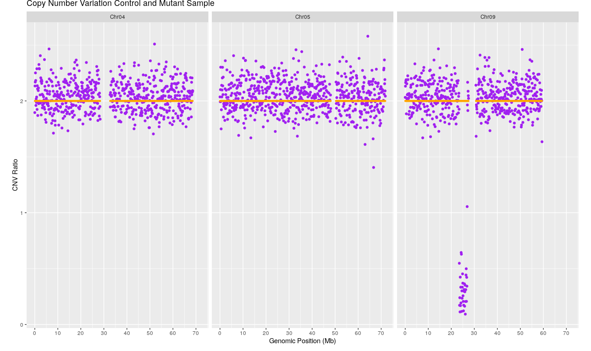

==============================================================================================
Data Analysis of Mutation Detection in Gamma-Irradiated Banana Using Low Copy Number Variation
==============================================================================================

=====================
:Author: Michael Hall
:Date: 07/14/2022
====================

Software Prerequisites
======================

#Burrows-Wheeler-Aligner
(http://bio-bwa.sourceforge.net/)(see line 126).
#Download and Install BBmap
https://sourceforge.net/projects/bbmap/
Bin-by-Sam-tool (see github repository)
Python version 2.7(See enivornment .yaml)

**Banana**

**Procure your raw FASTQ reads from NCBI of two Banana samples, one is a known mutant Novaria and the other is a wildtype Naine and follow the protocol.**
**Efficient Screening Techniques to Identify Mutants with TR4 Resistance in Banana**
p.117 - 127
**Use clumpify script to remove duplicates**

(https://www.ncbi.nlm.nih.gov/bioproject/PRJNA627139)

#Download sratools

.. code:: shell

	srapath SRR11579627

	prefetch SRR11579627

	wget https://sra-downloadb.be-md.ncbi.nlm.nih.gov/sos3/sra-pub-run-21/SRR11579627/SRR11579627.1

	#Convert SRA into fastq

	fastq-dump --split-3 SRR11579627

	srapath SRR11579628

	prefetch SRR11579628

	wget https://sra-downloadb.be-md.ncbi.nlm.nih.gov/sos3/sra-pub-run-21/SRR11579628/SRR11579628.1

	#Convert SRA into fastq

	fastq-dump --split-3 SRR11579628

Rename FASTQ
============

	**Naine.R1.fq.gz**
	**Naine.R2.fq.gz**
	**Novaria.R1.fq.gz**
	**Novaria.R2.fq.gz**

	**Run the clumpify python script to remove duplicates per sample.**

.. code:: shell

	./clumpify.sh in=Naine.R1.fq.gz in2=Naine.R2.fq.gz out=Naine.R1.
	dedup.fastq.gz out2=Naine.R2.dedup.fastq.gz dedupe=t

	./clumpify.sh in=Novaria.R1.fq.gz in2=Novaria.R2.fq.gz out=Novaria.R1.
	dedup.fastq.gz out2=Novaria.R2.dedup.fastq.gz dedupe=t

Standard Output Clumpify python
===============================

.. raw:: html

##############################################################################################################################################################################################
	**NAINE**

	Done!
	Time:                           31.447 seconds.
	Reads Processed:         6262k  199.16k reads/sec
	Bases Processed:         1885m  59.94m bases/sec

	Reads In:              6262958
	Clumps Formed:         1730359
	Duplicates Found:         3782
	Reads Out:             6259176
	Bases Out:          1884185686
	Total time:     51.345 seconds.

	**NOVARIA**

	Done!
	Time:                           29.438 seconds.
	Reads Processed:         6000k  203.82k reads/sec
	Bases Processed:         1837m  62.43m bases/sec

	Reads In:              6000036
	Clumps Formed:         1648176
	Duplicates Found:         2026
	Reads Out:             5998010
	Bases Out:          1837286910
	Total time:     50.222 seconds.

####################################################################################################################################################################################################

Download Reference Genome NCBI
===============================
https://www.ncbi.nlm.nih.gov/assembly/GCF_000313855.2

.. code:: shell

	mkdir BananaGamma
	mv Novaria.R1.dedup.fastq.gz Novaria.R2.dedup.fastq.gz BananaGamma/
	mv Naine.R1.dedup.fastq.gz Naine.R2.dedup.fastq.gz BananaGamma/
	cd BananaGamma

	mkdir Genome
	mv *.fna Genome/
	cd Genome bwa index *.fna

	cd ../

	https://github.com/lh3/bwa
        
	#It is recommended not to download bwa software from source a.k.a github but rather through bioconda channel in conda
	#conda install -c bioconda bwa=0.7.17
	
	#Another way to get bwa software but do not necessarily use it.
	git clone https://github.com/lh3/bwa.git
	cd bwa; make
	./bwa
	#Needs to be Harvard Version
	
        ./bwa mem -M -t 4 -R '@RG\tID:Novaria \tSM: Novaria' ../Genome/*.fna Novaria.R1.dedup.fq Novaria.R2.dedup.fq > Novaria.dedup.sam

	./bwa mem -M -t 4 -R '@RG\tID:Naine \tSM: Naine' ../Genome/*.fna Naine.R1.dedup.fastq.gz Naine.R2.dedup.fastq.gz > Naine.dedup.sam

	samtools sort -O sam -T sam -T Novaria.sort -o Novaria_aln.sam Novaria.dedup.sam
	samtools sort -O sam -T sam -T Naine.sort -o Naine_aln.sam Naine.dedup.sam

	samtools view -b Novaria_aln.sam > Novaria.bam
	samtools view -b Naine_aln.sam > Naine.bam

	samtools index Novaria.bam
	samtools index Naine.bam

	mv Novaria_aln.sam Naine_aln.sam Bin-by-Sam-tool/
	cd Bin-by-Sam-tool
	python bin-by-sam_2.0.py -o N3_100kbin.txt -s 100000 -b -p 3 -c Naine_.aln.sam

Download the r package rom PBGLMichael/CNVseq repository
========================================================

.. code:: shell

	# Banana CNV

	setwd("/home/michael/Desktop/Banana/Banana_LC_WGS")
	devtools::install_github(repo = "PBGLMichaelHall/CNVseq",force = TRUE)
	library(CNV)

	CNV::CNV(file = "N3_100kbin.txt",Chromosome =  c("NC_025202.1","NC_025203.1","NC_025203.1","NC_025204.1","NC_025205.1",
	"NC_025206.1","NC_025207.1","NC_025208.1","NC_025209.1","NC_025210.1","NC_025211.1","NC_025212.1"),
	mutantname = "Novaria.Naine",controlname = "Naine.Naine",size = .75,alpha = 5,color="orange")

.. figure:: ../images/777.png

.. figure:: ../images/BANANA100K.png

Chromosome 5
============

.. code:: shell

	CNV::CNV(file = "N3_100kbin.txt",Chromosome =  c("NC_025206.1"),mutantname = "Novaria.Naine",
	controlname = "Naine.Naine",size = .75,alpha = .25,color="green")

.. figure:: ../images/Rplot777.png

===============
**Sorghum CNV**
===============

.. raw:: html

	**You have two BAM files one is a "mutant" and the other is a "control"**

	**First convert BAM to SAM**
	**The sam file must have an ending _aln.sam to work properly in python script**

	**CONTROL**

.. code:: shell

	samtools view -h con-2_S1-Chromes-04-05-09.bam > con-2_S1-Chromes-04-05-09_aln.sam

	**MUTANT**

.. code:: shell

	samtools view -h D2-1_S7-Chromes-04-05-09.bam > D2-1_S7-Chromes-04-05-09_aln.sam

bin-by-sam_2.0.py python script
===============================

.. code:: shell

	$python bin-by-sam_2.0.py -o N3_100kbin.txt -s 100000 -b -p 2 -c con-2_S1-Chromes-04-05-09_aln.sam

.. code:: shell

	CNV::CNV(file = "N3_100kbin.txt",Chromosome = c("Chr04","Chr05","Chr09"),mutantname = "D2.1_S7.Chromes.04.05.09.con.2_S1.Chromes.04.05.09",controlname = "con.2_S1.Chromes.04.05.09.con.2_S1.Chromes.04.05.09",size = .75,alpha = 5.0,color="orange")

.. figure:: ../images/SorghumCNV7.png

Chromosome 9
============

.. code:: shell

	CNV::CNV(file = "N3_100kbin.txt",Chromosome = c("Chr09"),mutantname = "D2.1_S7.Chromes.04.05.09.con.2_S1.Chromes.04.05.09",controlname = "con.2_S1.Chromes.04.05.09.con.2_S1.Chromes.04.05.09",size = .75,alpha = 5.0,color="orange")

